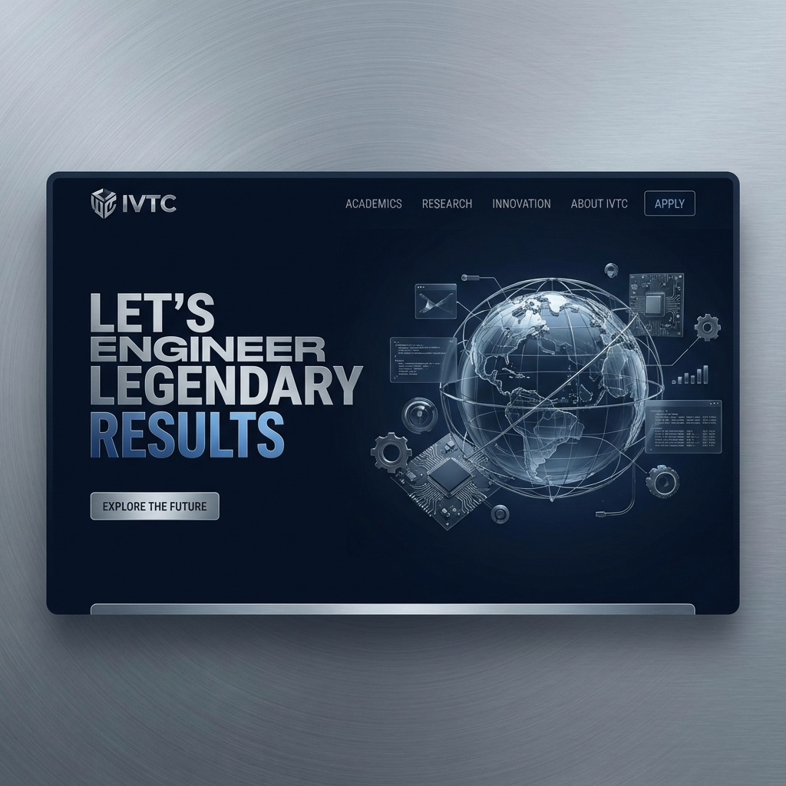

# IVTC Campus Landing Page

A premium, high-performance landing page for the International Virtual Training Campus (IVTC), engineered for a legendary digital experience.



## 💠 Brand Identity
The project has been recently updated to align with the new **IVTC Navy & Silver** corporate identity. The design features:
- **Midnight Navy Blue**: A professional, authoritative primary palette.
- **Silver & Slate Accents**: Clean, modern highlighting for icons and badges.
- **Bold Typography**: Heavy-weight tracking-tighter headers for a premium feel.

## ⚡ Key Features
- **Premium Transitions**: Custom GSAP-powered "Grid Reveal" page transitions for desktop.
- **High-End Animations**: Staggered scroll-triggered reveals using GSAP and ScrollTrigger.
- **Interactive Information Hubs**: Modern, responsive cards for contact info, faculty, and policies.
- **Campus Policy Engine**: An interactive, searchable documentation hub for academic and conduct guidelines.
- **Dark & Light Mode**: Seamless transition between corporate dark mode and a clean light mode.

## 🛠️ Technology Stack
- **Framework**: [Next.js 15+](https://nextjs.org) (App Router)
- **Animation**: [GSAP](https://greensock.com/gsap/) (GreenSock Animation Platform)
- **Styling**: [Tailwind CSS](https://tailwindcss.com)
- **Icons**: [Lucide React](https://lucide.dev)
- **Theme**: [next-themes](https://github.com/pacocoursey/next-themes)

## 🚀 Getting Started

First, install the dependencies:
```bash
npm install
```

Then, run the development server:
```bash
npm run dev
```

Open [http://localhost:3000](http://localhost:3000) with your browser to see the live result.

---
**Developed by [INZEEDO](https://inzeedo.com)**  
*Engineering Legendary Digital Futures.*
